# $\color{red}{\textsf{[DRAFT]}}$

# Scraping Certified BREEAM Assessments Data

## Executive Summary
Sustainability has become a paramount concern in contemporary architecture and construction, driving the adoption of various frameworks to evaluate and enhance the environmental performance of buildings. Among these, the Building Research Establishment Environmental Assessment Method (BREEAM) stands out as a leading international certification system, particularly influential in the UK and Europe. This study leverages advanced data science techniques to scrape, process, and analyze approximately 40,000 BREEAM-certified assessments from the GreenBookLive database. The objective is to uncover temporal and spatial trends, sectoral distributions, and regional concentrations of certified buildings. By doing so, the research provides actionable insights for architects, developers, and policymakers, supporting informed decision-making aligned with the UK's ambitious net-zero targets.

Key findings indicate a significant increase in high-level certifications ("Excellent" and "Outstanding") over the past five years, with the UK and the Netherlands leading certification efforts. The geographic distribution of BREEAM certifications reveals these countries' pivotal role in driving sustainability standards within Europe, while adoption is increasing in regions such as Asia (e.g., China) and the Middle East (Figure 1). Emerging clusters in the Netherlands reflect its strong commitment to sustainability, while the commercial and residential sectors dominate certifications across other regions. These insights underscore the importance of targeted policies and incentives to promote sustainable practices in underrepresented areas, contributing to the broader goal of environmental sustainability in the built environment

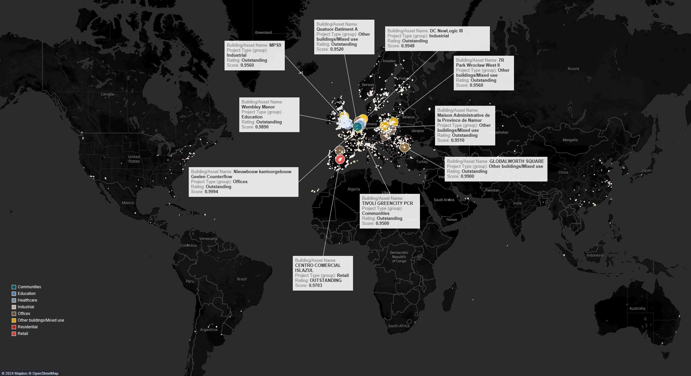
*Figure 1: Global map showing BREEAM-certified project locations, colour-coded by use class (e.g., Residential, Commercial).*

## Methodology
The study employs a comprehensive methodology encompassing data extraction, cleaning, analysis, and visualization to achieve its objectives. The following sections outline the detailed processes involved:

### 1. Data Collection

#### Web-Scraping Process
The data extraction process involved sophisticated web scraping techniques with `Python` to retrieve BREEAM certification data from the [GreenBookLive](https://www.greenbooklive.com/) database. Given the website's dynamic nature, a combination of HTTP requests and browser automation via `Selenium` was employed to effectively interact with and extract data from dynamically loaded content. Selenium is a web automation tool that allows programmatic interaction with web browsers, simulating user actions such as clicking and scrolling, which is essential for scraping dynamic websites.

#### Data Description
The dataset comprises information on BREEAM-certified buildings, detailing certifications, ratings, locations, and other attributes. Below is the detailed schema of the dataset:

| **Field Name**              | **Data Type** | **Description**                                                                                   |
|-----------------------------|---------------|---------------------------------------------------------------------------------------------------|
| **Building/Asset Name**      | String        | Name of the certified building or asset                                                           |
| **Client/Developer**         | String        | Name of the client or developer                                                                    |
| **Scheme**                   | String        | Certification scheme applied to the building (e.g., In-Use International)                          |
| **Rating/Score**             | String        | Descriptive rating and score for the building (e.g., Very good 58.7%)                              |
| **Rating**                   | String        | Final rating achieved (e.g., Very good, Good, Pass)                                                |
| **Score**                    | Float         | Numerical score achieved in the certification (e.g., 58.70%)                                       |
| **Stage/Valid Until**        | Date          | Date indicating until when the certification is valid                                              |
| **Certification Number**     | String        | Unique certification number assigned to the building                                               |
| **Assessor/Auditor**         | String        | Name of the assessor or auditor responsible for the certification                                  |
| **Town/Postcode/Zipcode**    | String        | Town and postcode/zipcode where the building is located                                            |
| **Country**                  | String        | Country where the building is located                                                              |
| **NSO**                      | String        | National Scheme Operator overseeing the certification                                              |
| **Other Information**        | String        | Additional information regarding the asset or project                                              |
| **Project Type**             | String        | Type of project (e.g., Offices, Retail, Industrial)                                                |
| **Rating (%)**               | Float         | Certification rating expressed as a percentage                                                     |
| **Latitude**                 | Float         | Geographical latitude of the building                                                             |
| **Longitude**                | Float         | Geographical longitude of the building                                                            |

*Table 1: Data Schema of BREEAM-Certified Buildings Dataset.*

#### Python Libraries:
    - `requests` for handling HTTP requests and fetching static content.
    - `lxml` for parsing HTML and extracting data fields.
    - `Selenium` with the Chrome WebDriver for automating browser interactions and handling JavaScript-rendered content.
    - `Pandas` for data cleaning, manipulation, and analysis.
    - `Folium` and `GeoPandas` for geospatial analysis and visualization.

#### Web Scraping Implementation:
Implementation Steps:

1. Selenium Configuration: Selenium WebDriver was configured with headless Chrome options to automate browser interactions without a graphical interface.
2. Page Navigation: Automated scripts navigated through multiple pages of the GreenBookLive database, handling pagination controls to ensure comprehensive data collection.
3. Data Extraction: Relevant data fields such as building name, location, certification date, certification level, and assessor information were identified and extracted from the HTML content using `lxml`.
4. Data Storage: The extracted data was initially stored in CSV files for intermediate storage and later imported into Pandas DataFrames for further processing.

### 2. Data Cleaning & Processing
Once the raw data was collected, extensive preprocessing was necessary to ensure accuracy and consistency, enabling reliable analysis.
#### Data Cleaning:
- **Duplicate Removal**: Redundant entries were eliminated using Pandas' drop_duplicates() function.
- **Standardizing Location Formats**: Inconsistent region names were standardized using mapping dictionaries (e.g., converting "N.W. England" to "North West England") to ensure uniformity across the dataset.
- **Date Format Standardization**: All certification dates were converted to a consistent YYYY-MM-DD format using Pandas' to_datetime() function, with erroneous entries coerced to NaT (Not a Time) and subsequently handled.
- **Handling Missing Data**:
    - **Imputation**: Missing geographical data were imputed based on known regional clusters of BREEAM-certified buildings. For categorical fields, mode substitution was applied where appropriate.
    - **Exclusion**: Records with critical missing fields, such as location or certification level, were excluded from specific analyses to maintain data integrity.
      
#### Categorization:
- **Building Type**: To facilitate sectoral analysis, buildings were classified into categories, including Residential, Commercial, Public Infrastructure, Industrial, and Others.
- **Region**: Data was grouped based on UK regions (e.g., London, Scotland, North West) to enable regional comparative studies.

### 3. Data Analysis and Insights

Exploratory Data Analysis was conducted to uncover patterns, trends, and insights within the BREEAM certifications dataset.

#### Temporal Certification Trends:

- **Analysis**: Time-series analysis tracked annual changes in BREEAM certification ratings over the past ten years, segmented by rating levels (Pass, Good, Very Good, Excellent, Outstanding).

- **Visualization**: Pie charts for each year depict the proportion of certifications across different rating levels from 2013 to 2022. A noticeable trend is the **steady increase in higher certification levels**, particularly **Outstanding** and **Excellent** ratings. These higher-level certifications have grown significantly over time, reflecting an industry-wide shift toward achieving greater sustainability performance in buildings. Early years, such as 2013 and 2014, were dominated by "Very Good" and "Good" ratings, while by 2022, a larger portion of certifications had moved toward "Excellent" and "Outstanding" ratings (Figure 2).

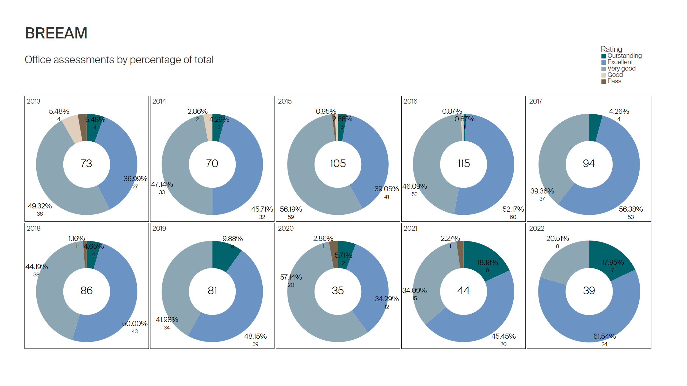
*Figure 2: Pie chart depicting the number of office BREEAM certifications in the UK over each year from 2013 to 2022 colour-code by rating.*

#### Sectoral and Regional Distribution:
The bar charts illustrate the **number of "Outstanding" BREEAM certifications** in the **Office** and **Industrial** sectors over time. The charts break down certifications by country, providing clear insights into the trends across different regions and building types.

#### Offices: Outstanding BREEAM Certifications by Year and Country (Figure 3)

- **Analysis:**  
  The office sector shows a consistent increase in the number of **Outstanding certifications** from 2012 to 2024. The United Kingdom dominates the chart, consistently maintaining the highest number of certified assessments each year. Countries such as the **Netherlands**, **France**, and **Poland** also show notable growth, contributing to the overall increase in certifications in recent years.

- **Findings:**  
  A sharp rise in certifications is observed in 2021, with the total number reaching its highest in **2023**. This could be linked to stronger sustainability regulations and corporate commitments in these regions. The chart also shows that certifications are expanding beyond just the UK, with countries like **Romania** and **Russia** achieving certifications by 2022 and 2023, respectively.

- **Implication:**  
  The increase in certifications across multiple countries suggests that **sustainability standards** are becoming more prevalent across Europe. The UK’s sustained leadership in certifications points to ongoing governmental and corporate efforts to adhere to green building standards. Emerging countries on the list also indicate that BREEAM certifications are expanding geographically, showcasing broader adoption of sustainability in the office sector.

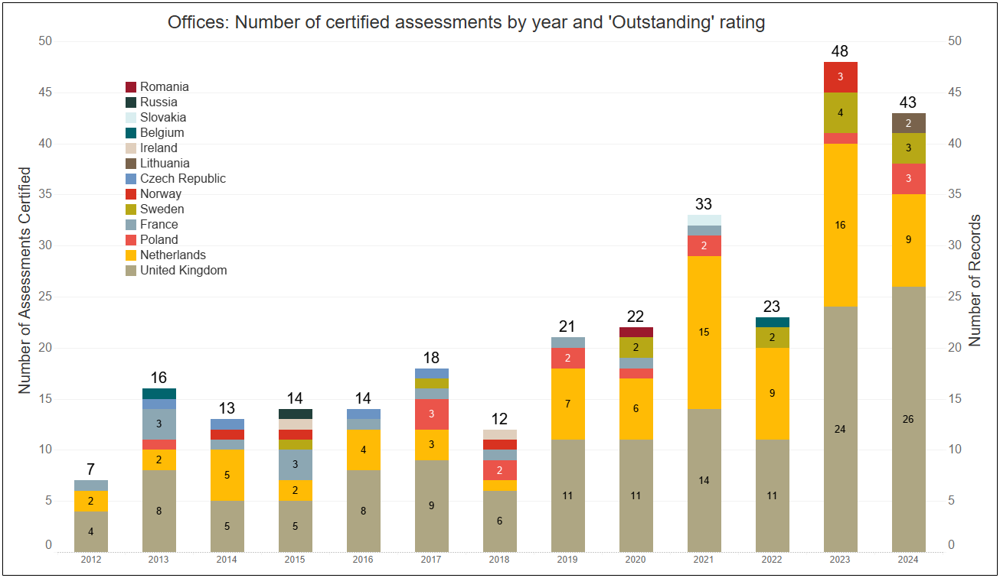
*Figure 3: Bar chart showing the number of "Outstanding" certifications in the Office sector.*

#### Industrial: Outstanding BREEAM Certifications by Year and Country (Figure 4)

- **Analysis:**  
  In the industrial sector, **the Netherlands** and **the United Kingdom** lead the certifications, with **the Netherlands** showing a clear dominance since 2019. The UK follows closely behind, demonstrating substantial growth in the number of certified industrial buildings. Countries such as **Slovakia**, **Sweden**, and **Czech Republic** also feature in the certifications, though in much smaller numbers compared to the top two.

- **Findings:**  
  The number of "Outstanding" certifications peaked in **2023**, reflecting the growing importance of sustainability in the industrial sector. The Netherlands leads the charge, contributing to the majority of certifications from 2019 to 2024. The rise in certifications in this sector suggests that **industrial buildings**, which were traditionally less focused on sustainability, are now being brought into the fold of sustainable building practices.

- **Implication:**  
  The growing number of certifications in the industrial sector highlights the increasing focus on sustainability in traditionally energy-intensive industries. The leadership of **the Netherlands** in certifications reflects strong regulatory frameworks and industrial initiatives to reduce environmental impact. Other countries joining the trend may indicate a broader European commitment to **sustainable industrial growth**.

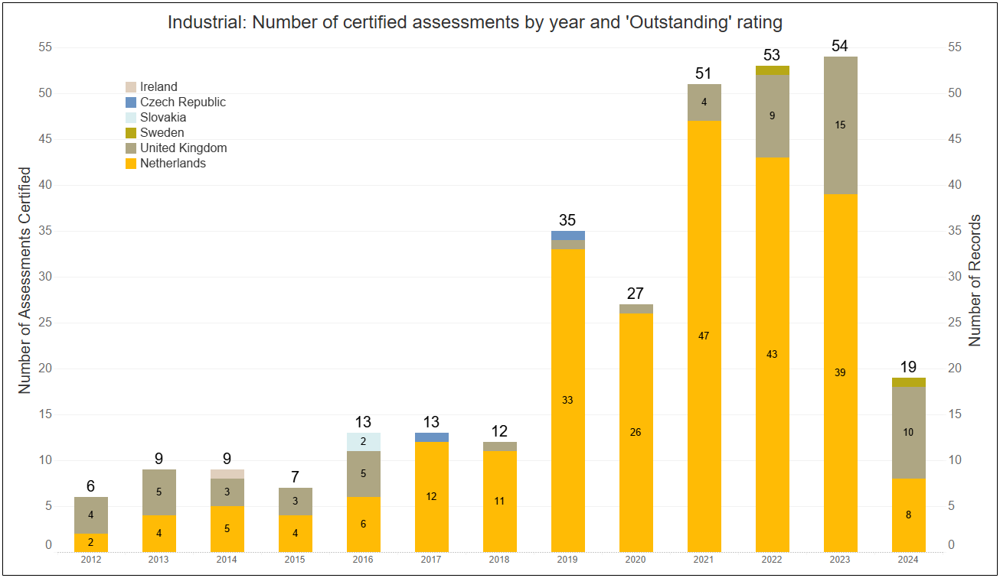
*Figure 4: Bar chart showing the number of "Outstanding" certifications in the Industrial sector.*

- **Overall Insights**:

- The data from both the **Office** and **Industrial** sectors highlight the **increasing importance of sustainability** in diverse types of developments.
- **The United Kingdom** remains a leader in BREEAM certifications, particularly in the office sector, while **the Netherlands** dominates the industrial certifications since 2019.
- The expansion of certifications across countries like **Poland**, **Romania**, and **Slovakia** suggests growing awareness and adoption of sustainable building practices beyond traditional strongholds in the UK and Western Europe.

#### Sectoral and Geospatial Analysis

The data was segmented by building type and region to uncover sector-specific trends and geospatial patterns. The analysis focused on **commercial**, **residential**, **industrial**, and **mixed-use** buildings across different regions, allowing for detailed insights into how sustainability certifications vary by sector and geography.

Interactive maps were generated using **Folium** and **GeoPandas** to display the density and spatial distribution of BREEAM-certified buildings. **Commercial buildings** in **London** and the **South East** demonstrated particularly high certification rates.

- **Findings in London**:  
  High-density BREEAM-certified clusters were identified, with **commercial office buildings** such as **The Featherstone Building** and **Bloomberg** achieving **Outstanding** ratings ((Figure 5). These areas lead in setting high sustainability standards for office spaces. 

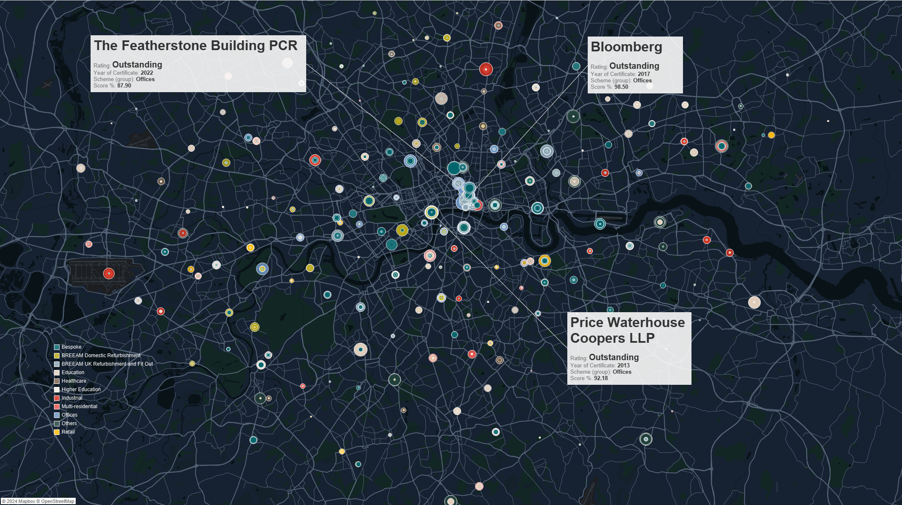  
*Figure 5: Detailed map of London showing BREEAM-certified project locations, color-coded by use class.*

The distribution of certifications across the **UK** and **Europe** was further explored, revealing sector-specific trends. The maps showed that while **London** and the **South East** lead in commercial certifications (Figure 6), **Scotland**, the **North West**, and regions across **Europe** have seen increasing certifications in **residential**, **mixed-use**, and **industrial** projects.

- **UK and European Findings**:
  - **Residential certifications** surged in the **North West** and **Scotland**, particularly in areas undergoing urban renewal, such as **Manchester** and **Glasgow**.
  - **Industrial projects** showed significant activity in regions like **Belgium** and the **Netherlands**, reflecting a growing trend toward sustainability in traditionally energy-intensive sectors.
  - Expanding certification clusters were noted in **Germany**, **the Netherlands**, and **France**, with Germany focusing heavily on **industrial developments** and the Netherlands on **office spaces**.
  - The spread of **Outstanding** and **Excellent** ratings across **Belgium** and the **Netherlands** demonstrates the broader uptake of BREEAM standards in **mixed-use** and **industrial sectors**, beyond just commercial buildings.

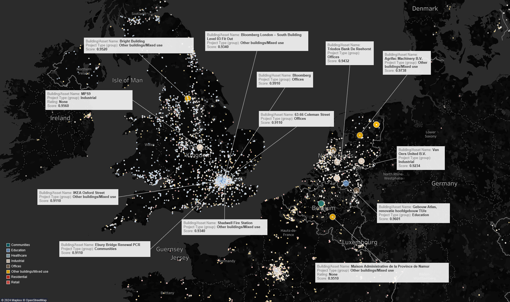  
*Figure 6: Detailed map of Europe and the UK showing BREEAM-certified project locations, colour-coded by use class.*

### 4. Cluster Analysis with Machine Learning

To gain deeper insights into the relationships between building type, certification levels, and geographic distribution, unsupervised machine learning techniques such as **K-Means Clustering** and **DBSCAN** (Density-Based Spatial Clustering of Applications with Noise) were applied. These methods helped reveal patterns and form distinct groups within the dataset based on features such as certification level, location, and building type.

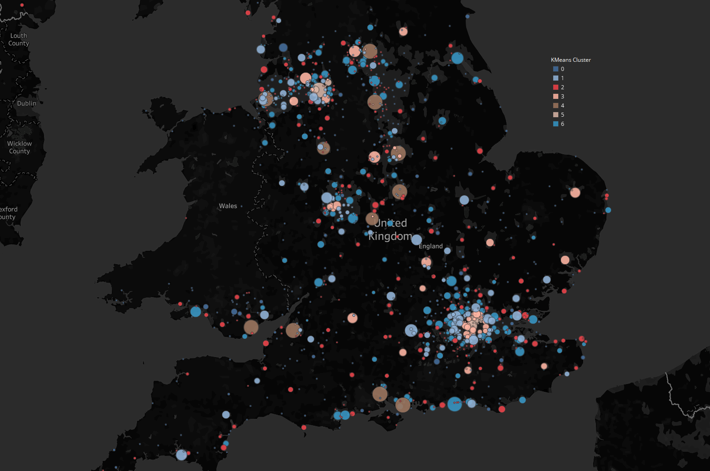
*Figure 7: Clustering of BREEAM-Certified Projects Across Europe and the UK Using K-Means and DBSCAN, Color-Coded by Use Class*

#### K-Means Clustering:

**Objective:**  
The goal of K-Means clustering was to group buildings based on their certification rating, type, and geographic location. By identifying distinct clusters, the analysis aimed to reveal patterns in certification performance and geographic concentration.

**Feature Engineering:**  
Key features used in the clustering model included:
- **Certification rating** (e.g., Pass, Good, Very Good, Excellent, Outstanding)
- **Building type** (e.g., Commercial, Residential, Industrial)
- **Geographic coordinates** (latitude, longitude)
- **Year of certification**

These features were standardized to ensure uniformity across the dataset, ensuring that no single feature disproportionately influenced the clustering results.

**Cluster Determination:**  
The optimal number of clusters (*k*) for K-Means was identified using several techniques:
1. **Elbow Method:** This method plots the total within-cluster sum of squares (inertia) against different values of k. The optimal number of clusters is determined by identifying the "elbow point," where the graph starts to flatten, indicating diminishing returns with additional clusters.

  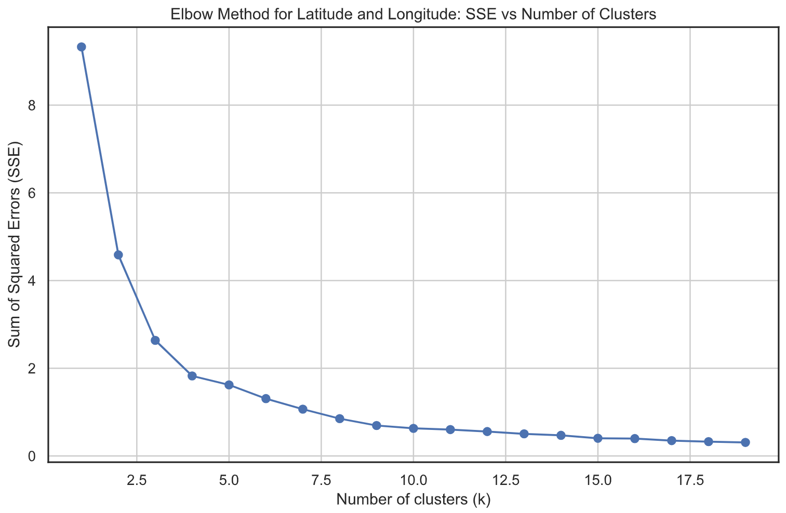

  Figure 4: Elbow Method for Determining Optimal Number of Clusters (k).

   
2. **Silhouette Scores:** This metric measures how similar an object is to its own cluster compared to other clusters. The silhouette score ranges from -1 to 1, with higher values indicating better-defined clusters. It was used to validate the optimal number of clusters by measuring cluster cohesion and separation.

  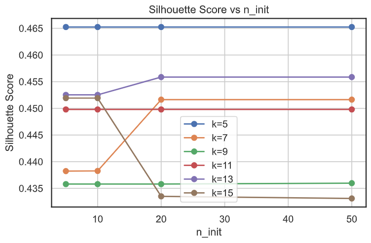

  Figure 2: Silhouette Score indicating the cohesion and separation of clusters.

3. **Calinski-Harabasz Index (Variance Ratio Criterion):** This index considers the ratio of within-cluster dispersion to between-cluster dispersion. Higher values indicate better-defined clusters.

  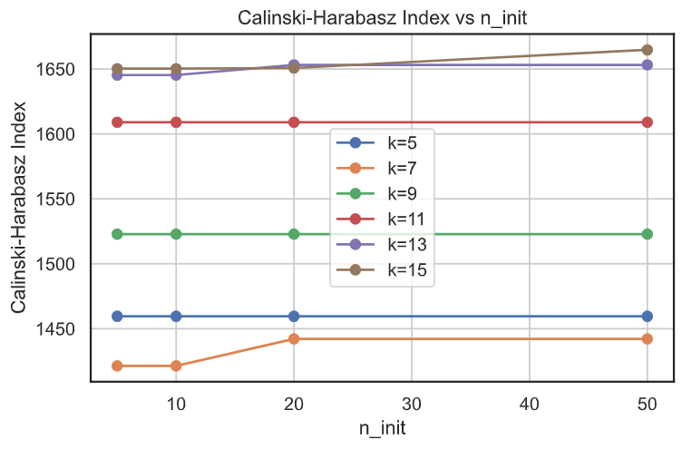

  Figure 3: Calinski-Harabasz Index representing cluster compactness.

 

6. **Davies-Bouldin Index:** This metric evaluates cluster separation by comparing the average distance between clusters with the size of clusters themselves. Lower values of the Davies-Bouldin index indicate better separation between clusters.

These methods helped ensure meaningful and distinct groupings of the buildings based on their certification, type, and location.

  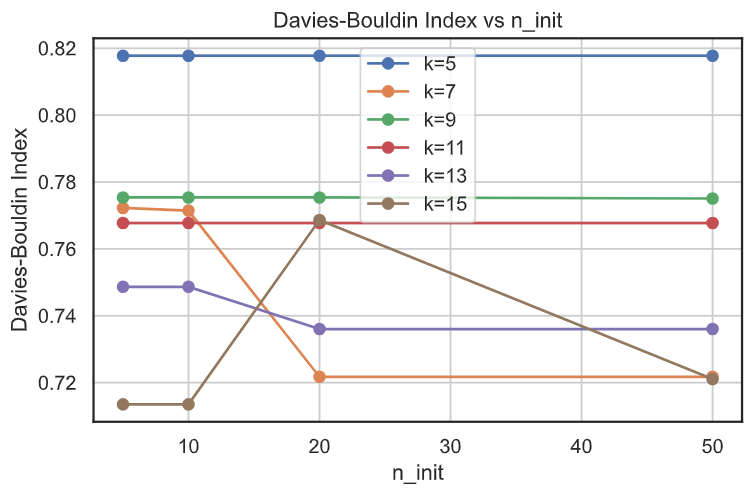

  Figure 4: Davies-Bouldin Index measuring cluster separation.

 

#### DBSCAN (Density-Based Spatial Clustering of Applications with Noise):

**Objective:**  
While K-Means is useful for partitioning data into a fixed number of clusters, DBSCAN was applied to identify clusters of varying density, particularly useful for spatial data. It allowed for the discovery of clusters without needing to predefine the number of clusters, making it well-suited for detecting patterns in geographic data.

**Parameter Tuning:**
- **Min Samples:** The minimum number of points required to form a dense region. This parameter was tuned to prevent small, isolated points from forming clusters.
  

  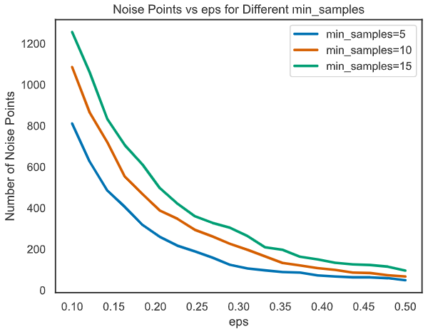

  Figure 5: Noise Points vs eps for Different min_samples in DBSCAN.

- **Epsilon (eps):** The maximum distance between two points for them to be considered in the same neighborhood. The optimal value of eps was found using methods such as:
   - **K-distance graph:** A plot of the k-nearest neighbors’ distance for each point in the dataset. The optimal eps value was determined where the graph shows a sharp change in slope (the "knee" of the curve).

  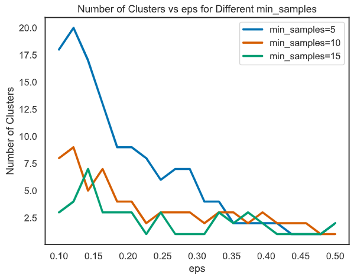

  Figure 6: Number of Clusters vs eps for Different min_samples in DBSCAN.

#### Evaluation of Clusters:

**Inertia:**  
For K-Means, **inertia** (the sum of squared distances of samples to their closest cluster center) was minimized to ensure tight clustering. Lower inertia values correspond to better-fitting clusters but are evaluated in combination with other metrics to avoid overfitting.

**Insights:**  
The clustering analysis provided the following key insights:
- **High-performing commercial buildings** were concentrated in **central London**, reflecting the city's leadership in sustainability-driven development. These clusters consisted of projects with higher BREEAM ratings such as "Excellent" and "Outstanding."
  
- **Emerging residential clusters** were identified in **northern regions**, particularly in **Manchester** and **Liverpool**, where large-scale housing developments are undergoing certification. These clusters reflected the increasing focus on sustainable residential buildings.
  
- **Public infrastructure projects**, including schools and hospitals, were predominantly clustered in **Scotland** and **Wales**. This reflects regional government initiatives promoting sustainability through public sector investment in green infrastructure.

- **DBSCAN Clusters:** The DBSCAN algorithm detected geographic clusters of varying densities, with prominent clusters forming around major urban areas, while less dense regions like rural areas showed fewer certifications. It also effectively identified isolated projects in regions undergoing urban development without forcing them into arbitrary cluster boundaries, as can happen with K-Means.

In summary, the combination of K-Means and DBSCAN, alongside the use of multiple evaluation metrics such as the **Elbow Method**, **Silhouette Scores**, **Calinski-Harabasz Index**, **Davies-Bouldin Index**, and **inertia**, provided robust and insightful clustering results. These insights help identify regions and sectors leading in sustainability and reveal geographic trends in building certification that can inform future urban planning and policy development.

### 5. Challenges and Solutions

The project involved scraping structured data from a relatively simple website, but there were a few notable challenges related to data collection and inconsistencies, particularly for non-UK/European projects.

- **Dynamic Content Loading:**  
  The website featured pagination and links to individual assessment pages for each project, which required merging the main page data with additional data from the detailed assessment pages. **Selenium** was used to handle this process, automating browser interactions to fully load dynamic content. Selenium’s WebDriver allowed interaction with JavaScript elements, ensuring that pagination and links were accessed correctly.

- **Data Collection:**  
  The main challenge was the need to scrape multiple pages and combine data across assessments. The links to individual assessments contained additional information that was merged with the summary data on the primary pages. Using **lmxl** and **Requests**, the data was parsed and stored efficiently. Pagination was handled by iterating over pages and collecting all necessary links to the individual project pages.

- **Data Inconsistencies:**  
  Many projects located outside of the UK/Europe had inconsistent or missing location data, especially latitude and longitude information. For over 40,000 locations, addresses were geocoded using **geopy** to retrieve approximate coordinates based on the available addresses. The accuracy of these coordinates depended on the quality of the address data, which was sometimes incomplete or ambiguous for certain international projects.

- **Ethical Compliance:**  
  The scraping process adhered to the terms set in GreenBookLive’s robots.txt file and terms of service. The scraping rate was throttled to avoid overloading the server, and no sensitive or non-public data was accessed. Data anonymization was applied where necessary.

### 6. Data Analysis and Insights

The cleaned and processed data underwent rigorous analysis to extract meaningful insights into BREEAM certifications.

#### Temporal Certification Trends:

**Observation:** The number of buildings receiving BREEAM certifications has steadily increased over the past five years, with a significant rise in higher-level certifications ("Excellent" and "Outstanding").

**Implication:** This trend aligns with increased regulatory pressures and heightened industry commitment to sustainability standards.

#### **Land Use and Sectoral Distribution**

- **Analysis:** The dataset was categorized by building type (residential, commercial, public infrastructure, industrial) to assess land use distribution trends.

- **Findings:** While commercial and residential buildings remain dominant, there is a noticeable increase in certifications within the public and industrial sectors.

*Figure 4. xxx*

The chart highlights a diversification in land use among certified buildings, with significant growth in public infrastructure and industrial sectors. This shift indicates a broader adoption of sustainability practices across various types of developments, beyond the traditional commercial and residential domains.

#### Regional Disparities:

**Observation:** London and the South East maintain the highest number of certified buildings, while regions like Scotland and the North West are emerging as new sustainability hotspots.

**Implication:** Regional growth in certifications suggests effective local government initiatives and urban regeneration efforts promoting sustainable construction.

#### Sectoral Breakdown:

**Observation:** The commercial and residential sectors dominate BREEAM certifications. However, there is notable growth in the public sector, particularly in infrastructure projects within Scotland and Wales.

**Implication:** Increased public sector certifications indicate governmental support and incentives for sustainable development in key infrastructure areas.

*Figure 6: Bar chart showing the number of "Outstanding" certifications in the Office sector.*

*Figure 7: Bar chart showing the number of "Outstanding" certifications in the Industrial sector.* 

### Conclusion

This study demonstrates the efficacy of data-driven approaches in understanding the dynamics of sustainable construction through the lens of BREEAM certifications. The significant growth in high-level certifications underscores the industry's commitment to environmental sustainability, while regional and sectoral analyses highlight areas of strength and opportunities for targeted policy interventions. As the UK progresses toward its net-zero goals, these insights provide valuable guidance for architects, developers, and policymakers in fostering sustainable building practices. Future research directions include expanding the analysis to other global sustainability frameworks, assessing the economic and human-centric impacts of certifications, and integrating Geographic Information Systems (GIS) for more nuanced spatial analyses.

