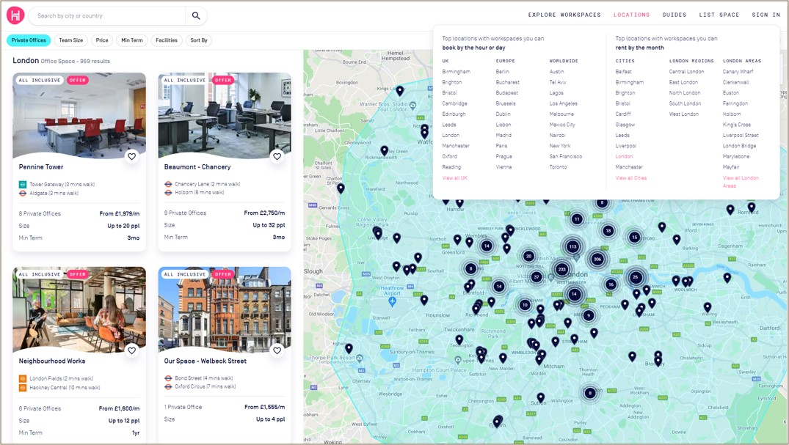
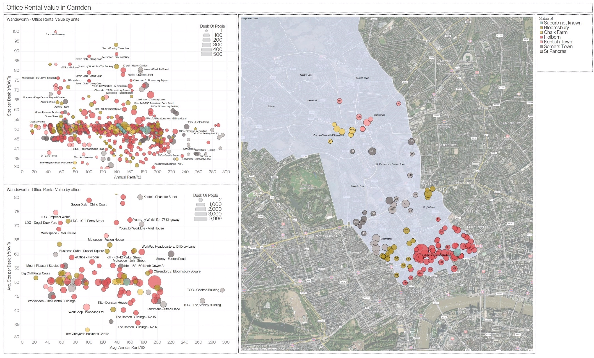
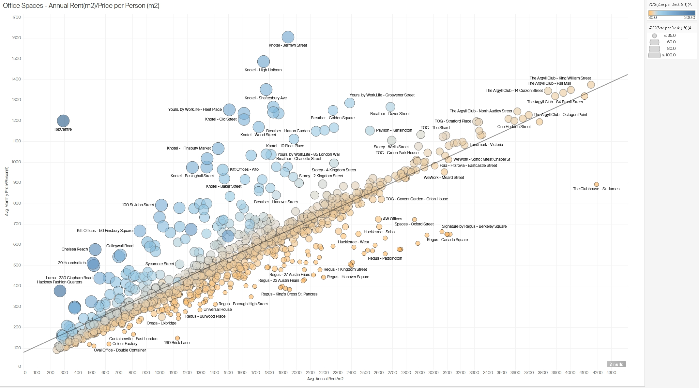
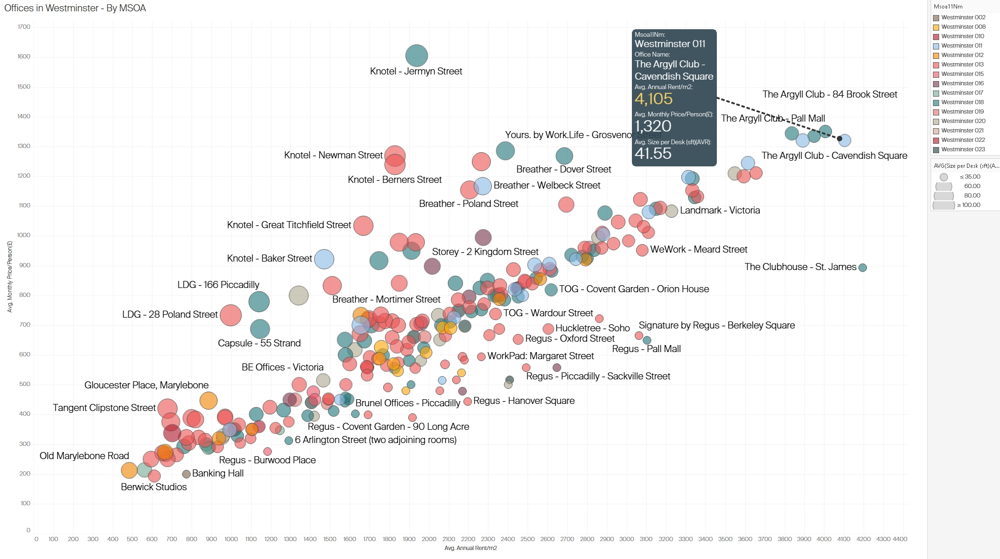

# HubbleHQ: A Data-Driven Exploration of London’s Office Rental Market

To support decision-making in an office development project, web scraping was used to collect up-to-date data on London office rentals from [HubbleHQ](https://hubblehq.com/), filling gaps left by traditional datasets. Python's Selenium library automated interactions to handle dynamic content loading, enabling comprehensive data collection. Key metrics included rental prices, desk availability, and spatial configurations. Challenges like dynamic page loading, missing data, and incomplete geolocation were addressed through automated scrolling, data cleaning, and location approximation methods.

By leveraging web scraping for real-time data acquisition, this project created a detailed dataset on London office rentals, supporting competitive analysis and pricing strategies. The automated approach enabled the capture of dynamic, accurate market data, demonstrating the value of up-to-date information in commercial real estate decision-making.


*Figure 1: HubbleHQ interface showing London office rental listings with location markers and filters for office type, team size, and price.*

## Project Scope and Methodology

### Objectives
- Gather real-time data on office rental spaces in Westminster and other London areas.
- Extract essential fields such as monthly rent, number of desks, and area size to analyze trends.
- Employ Python’s web scraping libraries to create an efficient, repeatable data collection process.
- Analyze rental price trends and availability in both established business districts and emerging areas.
- Utilize mapping techniques to visualize office listings geographically, enabling intuitive comparisons of office space density and pricing.

### Tools and Libraries
- Requests and BeautifulSoup: For HTTP requests and HTML parsing.
- Pandas: For data cleaning and transformation.
- Matplotlib/Seaborn: For visualisation of rental trends by area.

## Step-by-Step Data Collection Methodology

### 1. Web Scraping Setup:
A structured approach using BeautifulSoup and Requests allowed for targeted data extraction. The URL of interest was HubbleHQ, ensuring compliance with the site’s robots.txt guidelines.

```python
import requests
from bs4 import BeautifulSoup
import pandas as pd

# Send request and parse HTML
url = 'https://hubblehq.com/'
response = requests.get(url)
soup = BeautifulSoup(response.text, 'html.parser')

# Extract key data fields
offices = soup.find_all('div', class_='office-listing')
data = []
for office in offices:
    name = office.find('h2').text
    price = office.find('span', class_='price').text
    location = office.find('span', class_='location').text
    data.append([name, price, location])

# Save data to CSV
df = pd.DataFrame(data, columns=['OfficeName', 'Price', 'Location'])
df.to_csv('office_data.csv', index=False)
```

### 2. Data Cleaning and Transformation:
To ensure consistency across the dataset, I normalized monetary values and standardized spatial metrics:
- Handling Missing Values: Listings with incomplete data were either discarded or imputed based on similar listings.
- Numerical Conversion: Price strings like "£900/month" were converted to numeric for calculation purposes.
- Normalization: Rent values were standardized per square foot/meter, enabling comparisons across locations. (Figure 2)
  

*Figure 2: Distribution of office spaces in London based on annual rent per square meter and average desk sizes.*

### Challenges Encountered
- **Dynamic Content:** HubbleHQ’s listings page uses dynamic loading, meaning that office listings are not fully loaded when the page first loads. I had to utilize `Selenium` to automate scrolling and simulate interactions to scrape all available data.
- **Data Cleaning:** Some listings contained incomplete information, such as missing prices or inconsistent office size descriptions, requiring careful data handling to ensure accurate analysis.
- **Geolocation Issues:** Some office listings did not include exact addresses, which made geolocation mapping tricky. I used the nearest available data points to ensure these listings were mapped accurately.

```python
# Import necessary libraries
from selenium import webdriver
from selenium.webdriver.common.by import By
from selenium.webdriver.common.action_chains import ActionChains
from selenium.webdriver.support.ui import WebDriverWait
from selenium.webdriver.support import expected_conditions as EC
import pandas as pd
import time

# Initialize Selenium WebDriver (e.g., for Chrome)
driver = webdriver.Chrome()

# Navigate to HubbleHQ's listings page
driver.get("https://hubblehq.com/")

# Challenge 1: Dynamic Content - Scroll to load all listings
# Loop to scroll to the bottom of the page multiple times to load all dynamic content
last_height = driver.execute_script("return document.body.scrollHeight")
while True:
    # Scroll down to the bottom of the page
    driver.execute_script("window.scrollTo(0, document.body.scrollHeight);")
    time.sleep(2)  # Wait to allow listings to load

    # Check if more content loaded
    new_height = driver.execute_script("return document.body.scrollHeight")
    if new_height == last_height:
        break
    last_height = new_height

# Challenge 2: Extracting data while handling missing values
listings = driver.find_elements(By.CLASS_NAME, "office-listing")
data = []
for listing in listings:
    try:
        # Extract information from each listing
        name = listing.find_element(By.TAG_NAME, 'h2').text
        price = listing.find_element(By.CLASS_NAME, 'price').text
        location = listing.find_element(By.CLASS_NAME, 'location').text
        
        # Handle missing prices or descriptions by setting default values
        if not price:
            price = "N/A"
        if not location:
            location = "Unknown"
        
        data.append([name, price, location])
    except Exception as e:
        print(f"Error extracting data from listing: {e}")

# Convert data to a DataFrame for analysis
df = pd.DataFrame(data, columns=['OfficeName', 'Price', 'Location'])

# Challenge 3: Geolocation Issues
# For listings with incomplete geolocation data, fill in with nearest known data point
def approximate_location(location):
    # Placeholder function to estimate missing geolocation data
    return "Approximate coordinates based on nearby location"

df['Coordinates'] = df['Location'].apply(lambda x: approximate_location(x) if x == "Unknown" else "Exact coordinates")

# Save data to CSV for further analysis
df.to_csv('office_data_cleaned.csv', index=False)

# Close the browser
driver.quit()
```

#### Explanation of Key Parts:
- Dynamic Content: Scrolling is automated in a loop until the end of the page is reached, ensuring all listings are loaded.
- Data Cleaning: try-except blocks are used to handle missing or inconsistent data, setting defaults where information is missing.
- Geolocation Issues: A placeholder function (approximate_location) addresses cases with incomplete geolocation data by estimating locations based on nearby points.

### 3. Data Analysis and Visualisation
With the cleaned dataset, I conducted analyses to reveal trends in office pricing:

#### 3.1 Analysis of Office Rental Value in Camden 
This figure presents a spatial and quantitative analysis of office rental values in the Camden area. The chart is divided into two scatter plots on the left, showing rental prices by unit and office, respectively, and a map on the right that indicates the spatial distribution of office listings in Camden. The size and colour of the dots represent the number of desks or people the office space can accommodate, with larger and darker dots indicating higher capacities.

**Insights:**
- **Price Distribution:** Offices closer to the centre of Camden, such as those near Bloomsbury, tend to have higher rental values per desk, suggesting a premium for central locations.
- **Capacity vs. Cost:** Spaces that accommodate more desks or people often command higher rental prices, indicating that larger spaces are in demand in central business areas.
- **Suburban vs. Central:** Office spaces in more peripheral parts of Camden generally show lower rental rates, which could be more attractive for startups or small businesses seeking affordable options while staying close to Central London.


*Figure 3: Analysis of office rental value in Camden, showing spatial density and rental prices by unit and office*

#### 3.2 Correlation between Average Rent per Square Meter and Price per Person in London
This scatter plot illustrates the correlation between the average annual rent per square meter and the average monthly price per person across various office spaces in London. Each dot represents a different office, with dot sizes corresponding to the average size per desk. The color gradient indicates rent levels, with warmer tones (e.g., orange) representing higher rent values.

**Insights:**
- Positive Correlation: There is a clear positive correlation between rent per square meter and price per person, with a trend line showing that higher rents per square meter usually correspond to higher per-person prices. This correlation emphasizes that premium spaces charge more for individual desk spaces.
- Price Outliers: A few office locations (e.g., in premium areas like Mayfair or Soho) stand out with exceptionally high prices per person, indicating exclusive office spaces with high demand.
- Desk Size Variations: The larger circles indicate offices with more spacious desk setups, suggesting that offices with larger individual desk areas charge a premium. This may appeal to companies that prioritize spacious work environments.


*Figure 4: Correlation between average rent per square meter and price per person in various London office spaces.*

#### 3.3 Office Rental Analysis in Westminster
This figure shows office rental data for Westminster, focusing on average rental prices per square meter, average monthly price per person, and desk size per office. Each point on the scatter plot represents an office location, with dot size reflecting the average size per desk and color coding by specific areas within Westminster.

**Insights:**
- High-Priced Areas: Locations in the core of Westminster, such as those near Cavendish Square, exhibit high rental prices both per square meter and per person. This area appears to attract premium rentals, likely due to its proximity to notable business districts and amenities.
- Desk Size and Pricing: Larger desk sizes in some locations correlate with higher pricing, suggesting that Westminster’s premium office spaces may cater to businesses that need more space per employee.
- Competitive Pricing: Some offices offer lower-than-average prices in Westminster, potentially as competitive options for businesses wanting a central location without paying premium rates.


*Figure 5: Analysis of office rentals in Westminster with insights into pricing and average desk size by location*


*Figure 6: Detailed office rental value analysis in Wandsworth, illustrating the distribution of prices and desk sizes across various offices*

### Technical Challenges
- Dynamic Content and CAPTCHA: Scraping required adjustments for JavaScript-rendered content and CAPTCHA restrictions are handled via Selenium when necessary.
- Adaptability: Regular checks and maintenance of the scraping scripts were necessary to accommodate website structure changes.

## Conclusions
This project demonstrated the utility of web scraping in capturing dynamic market data for informed decision-making in office space rentals. By structuring and analyzing the data, I could assess competitive pricing strategies and identify market opportunities, particularly in high-demand areas like Westminster. Web scraping offers a practical solution for obtaining real-time market insights, though it requires adherence to ethical and legal standards.


## Next Steps
While this project focused on London, the approach can be scaled to other cities where office rental markets are rapidly changing. Future analysis could include longitudinal studies to track market changes or compare London’s office rental trends with those in other major business hubs.
