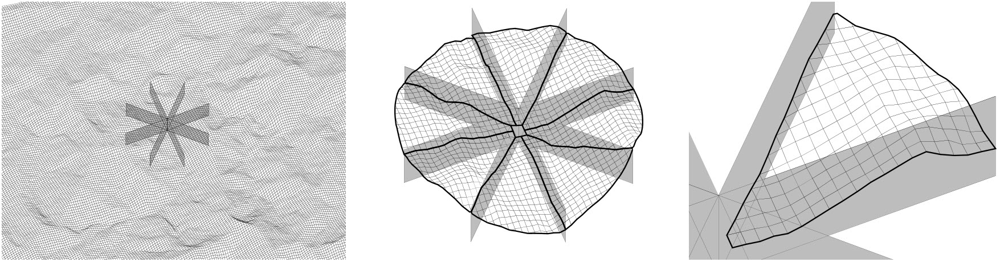
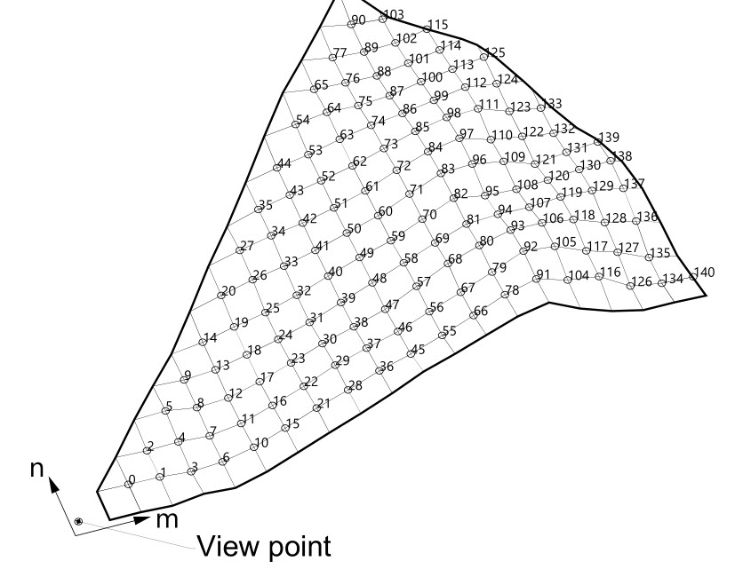

# Viewshed algorithm
## Author: Roly
## Date: Nov 14, 2020
### [Development of viewshed algorithm used in collaboration with Archaeologist Eduardo Mazuera to explore inter-visibility in Cuidad Perdida, Colombia](https://www.sciencedirect.com/science/article/pii/S0305440321000431)

The viewshed analysis is undertaken using Wang, Robinson, and White's (2000) reference plane method, which is computationally faster than methods based on sightlines. An auxiliary elevation model is defined to determine the viewshed score for any point in the DEM. The auxiliary elevation initially matches the underlying DEM and later its auxiliary height values are updated as the algorithm progresses. The point under evaluation is referred to as the view point, the surrounding DEM is divided into eight sectors, each bounded by cardinal compass points (Figure 1).  
   

   
Figure 1. DEM is subdivided into eight sectors around the view point.  
   
The eight boundaries between sectors are processed first. These can be analyzed using two-dimensional geometry as the points on each boundary lie in a single vertical plane. The process proceeds outwards from the view point, each time a sample point (n) from the DEM and previous point (n-1) from the auxiliary DEM are selected (Figure 2). Two vectors are defined from the viewpoint to the sample point and previous point (sample vector and previous vector) (Figure 2). Two vertical angles are compared to determine if the sample point is visible from the view point. The first angle (zvs) is between the vertical vector above the view point and the sample vector. The second angle (zvp) is between a vertical vector above the view point and the previous vector. If angle zvp is greater than zvs, the point is visible and the visibility score of the view point is incremented, the process continues to the next sample point. If zvp is smaller than zvs, the sample point is not visible (as shown in Figure 2), it is projected onto the previous vector. The elevation of the corresponding point in the auxiliary grid is updated to match and used to determine the visibility of the following sample points.  
   

   
Figure 2. Processing a sector boundary.  
   
To process a single sector, the sample points within the sector are first identified and ordered (Figure 3). The order of processing depends on the sector; for example, Figure 3 shows the first sector where each column of points (m) is processed sequentially outwards from the view point. For each column, the points are ordered by row (n).  
   

   
Figure 3. Sample points within a sector are identified and ordered.  
   
The sample point at (m, n) is selected from the DEM and two further points are identified (x point and y point) in the auxiliary DEM (Figure 4). The x and y points are always located between the sample point and view point and are used with the view point to define the reference plane. The relationship between the sample point and the x and y points depends on the sector. In sector 0 (Figure 4) the x and y points can be defined as (m-1, n-1) and (m-1, n) respectively. Once the reference plane is defined, the sample point at (m, n) is projected vertically into the reference plane. If the elevation of the projected point is less than the sample point’s elevation, the sample point is visible from the view point (Figure 4 left). Subsequently, the view score of the view point is incremented, and the process moves to the next sample point. If the elevation of the projected point is higher than the sample point’s elevation (Figure 4 right), then the sample point is not visible from the view point. The elevation of the projected point is stored in the corresponding point in the auxiliary DEM and the process moves to the next sample point. Figure 5 shows the visible sample points for the example sector in the figures.  
   

   
Figure 4. Determining visibility with a reference plane.  
  
Using plane method, an entire DEM can be processed and a view score assigned to each point defining a cumulative viewshed. To measure inter-visibility between settlements, cumulative viewsheds need to be determined between specific subsets of the original DEM where each subset represents points in the DEM contained by the boundary of an individual settlement. To measure terrain visibility, cumulative viewsheds are generated between specific subsets of the original DEM and the rest of the DEM. The implementation of the RP algorithm in this work allows for two distinct inputs: the viewpoints and the observed points. 

   
Figure 5. All visible sample points in sector 0.  
   
## References

Mazuera, E., & Hudson, R. 2021. Inter-visibility between settlements in pre-Hispanic Sierra Nevada de Santa Marta, Colombia. The relation between hierarchy and control of distant communications. Journal of Archaeological Science, 129, 105373.
Wang, J., White, K., Robinson, G., 2000. Generating viewsheds without using sightlines. Photogramm. Eng. Remote Sensing 66, 87–90.